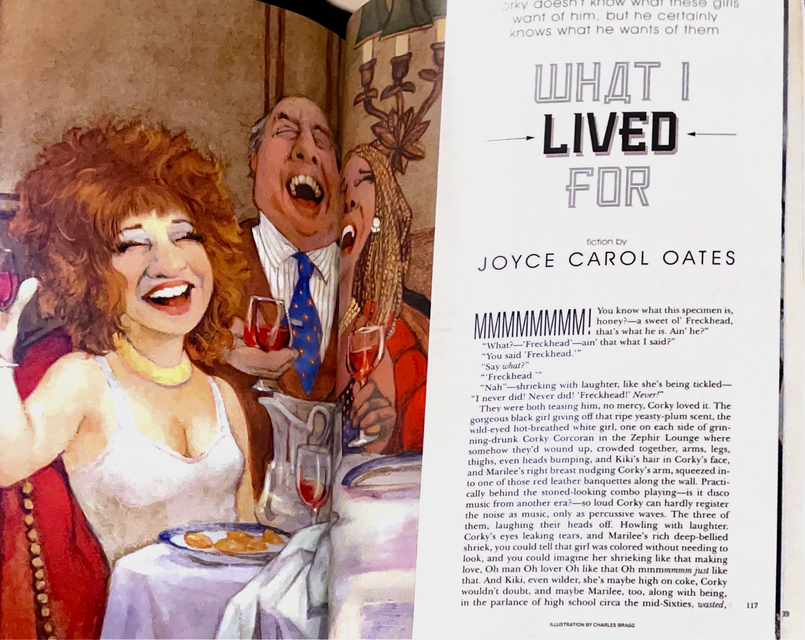

 {width=70% fig-align="center"}

<!-- Include brief introduction to/description of data essay  -->

<!-- If there are multiple datasets, please provide a title for each dataset with its own description  -->

<!-- # 1. Title of dataset 1 -->

# Data Table

```{ojs}
//| echo: false
import {viewof dataSummaryView, Tabulator, viewof selectedColumns, viewof dataSet, tableContainer, fetchData, generateTabulatorTableFromCSV, progress, progressbar} from "8bb63a6cde9addff"
```

```{ojs}
//| echo: false
//| output: false
raw_data = fetchData("https://raw.githubusercontent.com/Post45-Data-Collective/data/refs/heads/main/playboy_fiction_index/playboy-fiction-index-metadata_20260415.csv")
```

```{ojs}
//| echo: false
//| output: false

generateTabulatorTableFromCSV(
  "#table-container-playboy",
  "https://raw.githubusercontent.com/Post45-Data-Collective/data/refs/heads/main/playboy_fiction_index/playboy-fiction-index-metadata_20260415.csv",
  {
    displayedColumns: ["publication_date", "year", "author_name",
                       "title", "section", "last_name", "first_name", "author_gender",
                       "author_nea", "author_bestseller", "author_prize", "author_iowa"],
    columnPopups: [
      "Magazine issue date (MM/DD/YYYY)",
      "Year of the magazine issue (extracted from publication_date)",
      "Author name; standardized spelling and middle initials",
      "Story title; title case applied",
      "Section of the magazine in which the story appeared",
      "Author last name",
      "Author first name (including middle name)",
      "Author gender (M/F); N/A for co-authored or unverified",
      "NEA Creative Writing Fellowship recipient (yes/no)",
      "New York Times bestseller list author (yes/no)",
      "Major literary prize recipient (yes/no)",
      "Iowa Writers' Workshop MFA holder (yes/no)"
    ],
    rangeSliderColumns: ["year"],
    dateSliderColumns: ["publication_date"],
    categoryColumns: ["section", "author_gender", "author_nea", "author_bestseller", "author_prize", "author_iowa"],
    sortColumns: ["publication_date"],
    sortOrders: ["asc"],
    buttonContainerId: "#button-container-playboy",
    rawButtonId: "#download-raw-playboy",
    urlCopyButtonId: "#copy-url-playboy",
  }
);
```

<div id="table-container-playboy" style="height: 600px"></div>

Download Full Data (including hidden columns)

<div id='button-container'>
  <button id="download-raw-playboy"><i class="fas fa-download"></i> Download Full Data</button>
  <button id="copy-url-playboy"><i class="fas fa-copy"></i> Copy Full Data URL</button>
</div>

Download Table Data (including filtered options)

<div id='button-container-playboy'>
  <button id="download-csv"><i class="fas fa-download"></i> Download CSV</button>
  <button id="download-json"><i class="fas fa-download"></i> Download JSON</button>
  <button id="download-xlsx"><i class="fas fa-download"></i> Download Excel</button>
</div>

<div id="progress-container" style="width: 100%; display: block;">
  <progress id="progress-bar" style="width: 100%;" max="100" value="0"></progress>
  <div id="progress-text" style="text-align: center; margin-top: 5px;"></div>
</div>

# Top Authors

```{ojs}
//| echo: false
viewof topN = Inputs.range([5, 50], { value: 25, step: 1, label: "Number of authors to show:" })
```

```{ojs}
//| echo: false
Plot.plot({
  marginLeft: 220,
  height: topN * 20 + 60,
  x: { label: "Number of stories" },
  y: { label: null },
  marks: [
    Plot.barX(
      raw_data.filter(
        (d) =>
          d.author_name != null &&
          d.author_name !== "" &&
          d.author_name !== "N/A"
      ),
      Plot.groupY(
        { x: "count" },
        {
          y: "author_name",
          tip: true,
          fill: "gold",
          sort: { y: "x", reverse: true, limit: topN }
        }
      )
    ),
    Plot.ruleX([0])
  ]
})
```

::: {.callout-tip icon="false"}
## Creative Commons License

<p xmlns:cc="http://creativecommons.org/ns#">

This work is licensed under <a href="https://creativecommons.org/licenses/by/4.0/?ref=chooser-v1" target="_blank" rel="license noopener noreferrer" style="display:inline-block;">CC BY 4.0</a>

</p>
:::

# **Significance & Context**

The *Playboy* Fiction Index (1953–2020) documents a major but understudied site of postwar literary culture. From its founding in 1953 until the end of its print run in 2020, *Playboy* published over one thousand works of fiction by writers across genres, styles, and levels of prestige. While the magazine is often remembered for its centerfolds and erotica, it also served as a crucial venue for literary work, featuring stories by many of the twentieth century’s most acclaimed and widely read authors. For decades, its circulation far exceeded that of most literary magazines—at its peak in the 1970s, the magazine reached more than five million readers—meaning that a short story published in *Playboy* could reach an audience orders of magnitude larger than that of *The Paris Review*, *Esquire*, or *The Atlantic*.

This wide reach gave *Playboy* an outsized influence on postwar literary and cultural life that is rarely acknowledged in scholarly accounts of the postwar literary marketplace. The magazine’s fiction editors published a range of works in the fiction section. Literary fiction by contemporary authors such as John Updike, Joyce Carol Oates, Vladimir Nabokov, Margaret Atwood, and Saul Bellow was included in nearly every issue.

{width=60% fig-align="center"}

The magazine also included fiction under the heading of “Ribald Classics.” This section published prose works from classical and historical literature, often translated or adapted for contemporary readers. Authors included canonical figures such as Boccaccio, Petronius, La Fontaine, Marguerite de Navarre, Somadeva, Voltaire, and Arthur Conan Doyle. Ribald Classics typically emphasized erotic or bawdy elements—highlighting the magazine’s engagement with the sexual themes that were part of its broader aesthetic and thematic concerns. The designation of a subset of stories as ribald classics freed the main fiction section to feature contemporary stories that were not necessarily erotic in nature. By including these historical texts alongside contemporary fiction, *Playboy* offered readers access to a broad spectrum of storytelling traditions, from ancient works to medieval works, and across geographic boundaries, ranging from European to Middle Eastern and East Asian.

*Playboy* also emerged as an unexpected hub for midcentury and late-century science fiction, publishing dozens of stories by writers such as Arthur C. Clarke, Ursula K. Le Guin, Ray Bradbury, Ray Russell, and Frank Herbert. The magazine’s first fiction editors, Robie Macauley and, later, Alice K. Turner, developed an editorial identity that blurred the boundaries between literary prestige and popular appeal. 

Before joining *Playboy* in 1966, Macauley was already an established writer and editor of literary fiction. He received his BA from Kenyon College, where he was a student of John Crowe Ransom, and earned an MFA from the University of Iowa in 1950\. After several years teaching creative writing and literature at Bard College, the Iowa Writers Workshop, and University of North Carolina, Macauley succeeded Ransom as editor of the Kenyon Review in 1959, a post he held until he moved to *Playboy*. When he was approached by A.C. Spectorsky, then-publisher of *Playboy*, Macauley agreed to join as fiction editor on three conditions: “double the rates, get a lot more literary writers, like Updike and Cheever, \[and\] to have a free hand in choosing fiction, without anyone breathing over \[his\] shoulder” [@kennedyLastConversation1997].

When Macauley left *Playboy* in 1977 to become an editor at Houghton Mifflin, he was succeeded by Alice K. Turner, who served as fiction editor from 1980 to 2000\. Like Macauley, Turner had studied with a renowned literary scholar, Harold Bloom, and had a career as an editor before she joined Playboy. Despite their backgrounds in literary fiction, Macauley and Turner shared a partiality toward genre fiction. Across their tenures, *Playboy* built and consolidated a reputation as a prominent venue for literary and genre fiction alike. For many of the magazine’s regular contributors, *Playboy* offered an unusual combination of financial reward, cultural prestige, and mass visibility regardless of generic category. 

Turner herself articulated *Playboy*’s editorial philosophy in an interview reflecting on her tenure: “*Playboy* is a kind of heir to the old-fashioned middle-brow magazines of yore. Of the *Saturday Evening Post*. Of *Collier’s*. Of the middle-of-the-road story magazines. Which are probably the very first place that many people ever read a short story, ever read fiction at all. *Playboy* stories have beginnings, middles, and ends. They have a kind of general appeal. They are not experimental. They are not terribly modern or forward-reaching but they have real quality, or so I hope” [@turnerInterview1984]. Turner’s account underscores the magazine’s effort to maintain a balance between accessibility and literary seriousness. *Playboy* sought to extend the narrative clarity and broad appeal of earlier general-interest magazines while updating that tradition through contemporary authors, cosmopolitan themes, and, in the case of “Ribald Classics,” a dash of sexual libertinism. The result was a synthetic publication that brought together multiple genres and registers—popular and literary, erotic and serious, highbrow and lowbrow—within the pages of each issue.

The *Playboy* Fiction Index consolidates this extensive body of fiction into a single, accessible resource. It records every prose fiction piece published in the magazine between 1953 and 2020\. By collecting and standardizing this information for the first time, the Index makes it possible to study *Playboy*’s fiction not as a footnote to its visual or erotic content, but as a central component of its broader cultural and intellectual project. Moreover, it reframes *Playboy* not merely as an emblem of midcentury sexual politics but as a key institution in the postwar field of literary and cultural production. The Index thus provides a foundation for rethinking *Playboy*’s role in the history of postwar print culture, mass media, and literary production.

As Kinohi Nishikawa has noted, “Modern periodical studies’ open secret, then, is that although we recognize *Playboy* as one of the postwar era’s most important magazines, we do not actually do much work on it” [@nishikawaPlayboyGood2013]. Nishikawa attributes this neglect in part to the interpretive challenges the magazine poses: scholars examining *Playboy* often feel compelled to address its sexual politics and the objectification of women that structure its pages before turning to its literary content. While this remains an essential line of critique, it has also meant that *Playboy*’s fiction—its editorial networks, aesthetic preferences, and literary ambitions—has remained underexplored. Researchers interested in studying the magazine also face substantial material impediments. *Playboy* lacks a centralized institutional archive; no single repository holds the full editorial, business, or correspondence records that might illuminate its literary history. For scholars seeking to reconstruct the scope and significance of *Playboy*’s fiction, these conditions make sustained or aggregate study of the magazine difficult. The *Playboy* Fiction Index helps to address this gap by providing consolidated and verifiable data for tracking the fiction that appeared in the magazine, when it was published, and by whom. It serves as a practical bibliographic tool as well as a foundation for new work on postwar print culture. 

For scholars of post-1945 literature, periodical studies, media history, and gender studies, the dataset opens new possibilities for examining how fiction circulated through popular magazines; how the magazine is situated within the field of cultural production; and how literary and erotic economies intersected in the postwar literary marketplace. It invites research into questions such as:

- How did *Playboy*’s selection of authors evolve across decades, and what editorial choices shaped that selection?  
- What proportion of its fiction was written by women, and how did that change over time? How might these statistics compare to the gender breakdown of other mass-market magazines? And how can information about the gender of authors complicate received narratives about *Playboy’*s gender ideology?   
- How did the magazine function as a platform for science fiction and speculative writing, and what does this reveal about *Playboy*’s relationship to technology, futurism, and sexuality?  
- In what ways did *Playboy* help define or popularize a sensibility that combined genre fiction with literary fiction?  
- How does *Playboy* fit within the larger postwar literary marketplace? How does it compare to other magazines such as *The New Yorker*, *Esquire*, or *Harper’s* in terms of editorial priorities, aesthetic tone, and audience demographics?

# **Collection and Creation**

I compiled the *Playboy* Fiction Index manually in the fall of 2025 as part of a larger data-collection effort for a project that addresses the relationship between mass-market magazines and the publishing industry. To create the Index, I used *Playboy*’s online archive, which provides digital editions of each issue from 1953 to 2020\. Data was collected by inspecting the table of contents of each issue and recording relevant bibliographic information for all items labeled as “Fiction,” “Novelette,” “Novella,” or “Ribald Classic.” Ribald Classics entries that were not prose narratives (e.g., poems, jokes, or comic strips) were excluded. I chose to include all forms of prose classified as Ribald Classics rather than predetermine whether the piece could be considered fiction. Once collected, author names were standardized, resolving spelling variations and middle initials. I applied title case to all story titles and removed additional subtitles indicating part numbers when stories were published across multiple issues. Reprinted stories were not excluded. 

Author gender data was generated by cross-referencing *Publisher’s Weekly*, *The New York Times*, and other periodicals covering the literary marketplace, and inferring gender based on the pronouns that were used to describe the authors. Gender was recorded in binary form (male/female). In instances where searches did not yield any results or in instances of an anonymously published or co-authored piece, the author's gender was listed as N/A. 

Author-level metadata was generated by using fuzzy matching to compare the authors in the Playboy Fiction Index against those appearing in four datasets published by Post45 Data Collective: [The National Endowment for the Arts Creative Writing Fellowships (1965-2024)](https://data.post45.org/posts/nea-creative-writing-fellowships/); [The Index of Major Literary Prizes in the US](https://data.post45.org/posts/the-index-of-major-literary-prizes-in-the-us/); [New York Times Hardcover Fiction Bestsellers (1931–2020)](https://data.post45.org/posts/nyt_hardcover_fiction_bestsellers/); and [Iowa Writers’ Workshop](https://data.post45.org/posts/iowa_writers_workshop/). Matches were manually verified to ensure accuracy.

# **Description**

The *Playboy* Fiction Index documents the prose fiction published in *Playboy* magazine from 1953 to 2020\. The dataset contains 1862 stories by over 700 unique authors, drawn from 762 magazine issues. For most of the magazine’s publication history, it printed issues monthly; after 2016, publication became irregular. The Index captures basic bibliographic information about each story and author-level metadata.

In addition to recording the author and title name, I used the table of contents to determine the issue publication date and section label. The section field records the label assigned to each story in the magazine's table of contents — for example, “Fiction,” “Novelette,” or "Ribald Classic” — but this label reflects only how the story was categorized in that specific location. It does not necessarily indicate the story's actual form: a story listed as "Fiction" may be a novella in length or may be described as such elsewhere in the issue. Users should treat the section field as a record of the magazine's own organizational conventions rather than a definitive generic classification.

The Index includes a set of author-level metadata that allows researchers to track the author’s relative prestige, their market success, and their institutional affiliations: whether an author received a grant from the National Endowment for the Arts, appeared on the New York Times bestseller list, received a major literary prize, or held an MFA from the Iowa Writers’ Workshop.

Title case was applied to all story titles. Some stories appeared across multiple issues; for those stories, part numbers were removed. 

The dataset records authors only when they are explicitly named in the magazine’s table of contents (which was often not the case for many stories appearing in the “Ribald Classic” section). Stories with multiple authors are represented only in the author\_name field, with each author name separated by a semicolon. Author names were standardized to resolve inconsistencies.

Gender is recorded in binary form (male/female). Users should note that some of these fields condense or simplify information, particularly regarding co-authorship or anonymous publication.

**unique\_id** <br>
Unique identifier for each short story in the index

**publication\_date** <br>
Magazine issue date (MM-DD-YYYY); for combined Issue the earliest month is used (e.g., Jan/Feb 2016 is recorded as 01/01/2016; Spring 2020 is recorded as 03/01/2020)

**year** <br>
Year of the magazine issue, extracted from publication\_date

**title** <br>
Story title; title case applied

**section** <br>
Section of the magazine in which the short story appeared, as listed in the magazine table of contents

**author\_name** <br>
Author name; names were standardized resolving spelling variations and middle initials

**first\_name** <br>
Author first name, extracted from author\_name and including middle name

**last\_name** <br>
Author last name, extracted from author\_name

**author\_gender** <br>
Author gender, recorded in binary form (m/f); co-authored entries, pseudonyms, and authors for which reliable sources were not available were listed as N/A

**author\_nea** <br>
Indicates whether the author received a fellowship from the National Endowment for the Arts (NEA) (yes/no)
				  
**author\_bestseller** <br>
Indicates whether the author has appeared on the *New York Times* bestseller list (yes/no)

**author\_prize** <br>
Indicates whether the author is the recipient of a major literary prize (yes/no)

**author\_iowa** <br>
Indicates whether the author holds an MFA from the Iowa Writers’ Workshop (yes/no)

# **Ethical Considerations**

The *Playboy* Fiction Index inherits the biases of its source. Throughout its print history, *Playboy* privileged male authors and addressed a presumed male readership. As a result, the dataset reproduces the inequalities embedded in the magazine’s editorial and cultural formation. These limitations are not a flaw in the data but part of what makes it valuable for study. The gender column is therefore presented to support aggregate, historical analyses. Researchers can use it to examine patterns—such as the proportion of women contributors over time or the editorial treatment of gendered authorship—while remaining attentive to the broader social and institutional forces that underlie those patterns. 

# **Versioning**

After ceasing print publication in 2020, *Playboy* was revived in 2025 as an annual publication and subsequently as a quarterly publication. Future dataset updates will occur annually and will include new entries for stories published after 2025, as well as corrections of transcription errors and the addition of missing entries.

# **Bibliography**

*Playboy*. Playboy Enterprises, [www.iplayboy.com](https://www.iplayboy.com/).

::: {#refs}
:::

# **Licensing**

CC by 4.0

<link href="https://unpkg.com/tabulator-tables@6.3.0/dist/css/tabulator.min.css" rel="stylesheet">
<script src="https://unpkg.com/tabulator-tables@6.3.0/dist/js/tabulator.min.js"></script>

<!-- Excel script -->
<script type="text/javascript" src="https://oss.sheetjs.com/sheetjs/xlsx.full.min.js"></script>

# **Correction**

A previous version of this essay listed Don DeLillo among the contemporary authors published in *Playboy*; his name has since been removed.

# Citation
